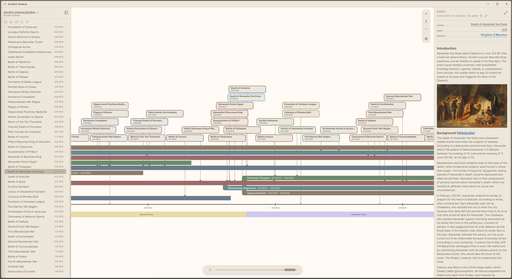
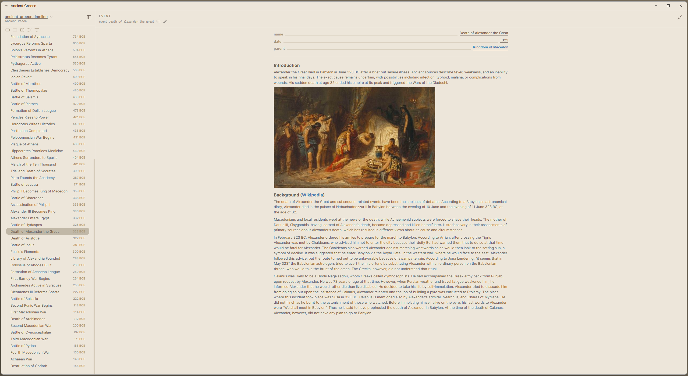
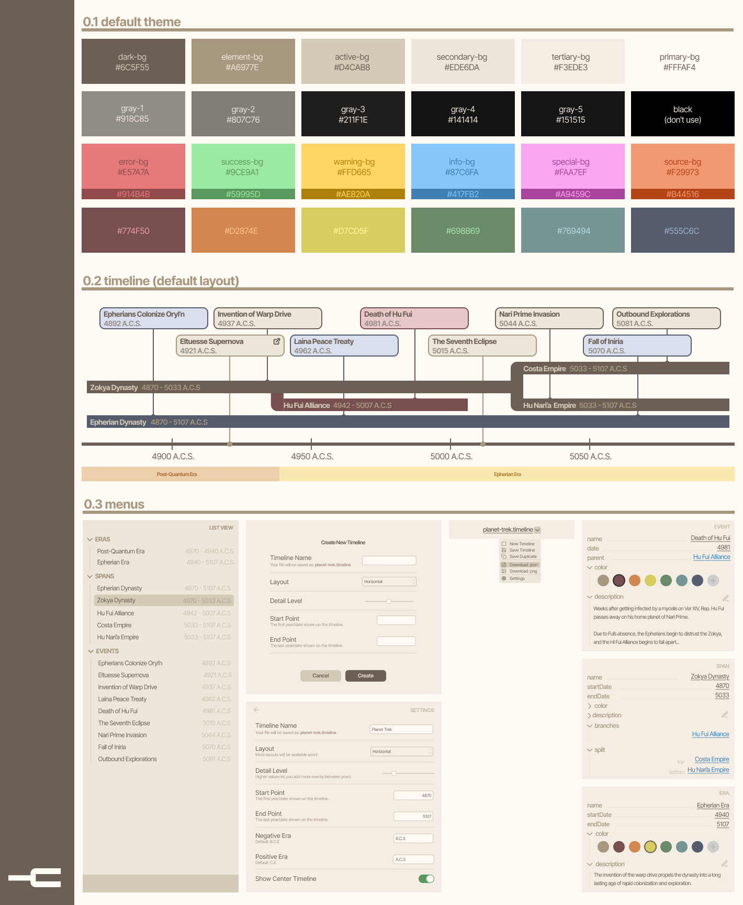

# 


A free, open-source app for creating customizable, interactive timelines for worldbuilding and history. Organize events, spans, and eras with tags and groups, link Markdown notes or MediaWiki sources directly to elements, and visualize timelines geographically with map view and coordinate support.

**An [early](https://github.com/sreegjl/timelines/releases/tag/v0.4.0-alpha.2) version is now available for testing.**

[](#)
[](#)
[](https://www.gnu.org/licenses/gpl-3.0)






## Development

**Prerequisites:** Node.js 20.19+ or 22.12+

```bash
npm install
```

**Run in development (Electron + Vite):**
```bash
npm run electron:dev
```

## Building

**Build the Electron app installer:**
```bash
npm run electron:build
```

<!--  -->
